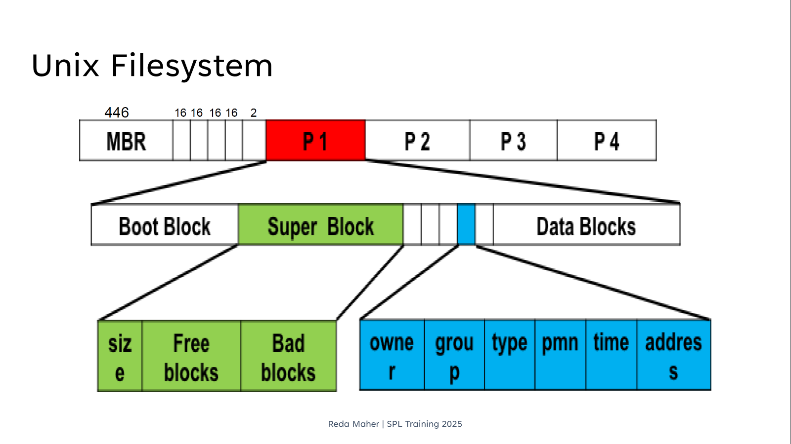
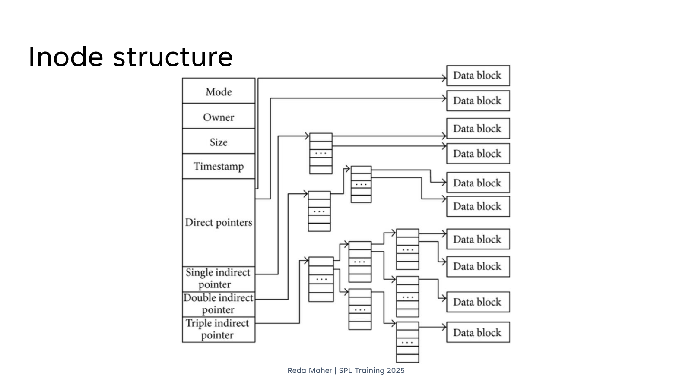

# File System & Partition Management Cheatsheet

## 📑 Table of Contents

- [MBR Layout](#mbr-layout-for-dd-cmd)
- [List Disks and Partitions](#list-disks-and-partitions)
- [List Partitions on a Specific Disk](#list-partitions-on-a-specific-disk)
- [Edit a Specific Disk](#edit-a-specific-disk)
- [Fdisk Help](#fdisk-help)
- [Create a New Partition](#create-a-new-partition)
- [Change Partition Type](#change-partition-type)
- [Delete a Partition](#delete-a-partition)
- [Print Partition Table Info](#print-partition-table-info)
- [Reload Partition Table Without Reboot](#reload-partition-table-without-reboot)
- [Advanced Topics FYI](#advanced-topics-fyi)
- [GPT Layout](#guid-partition-table-gpt-scheme-breakdown)
- [Unix Filesystem Structure](#unix-filesystem-structure)
- [Devices on Linux/Unix](#devices-on-linuxunix)
- [Mounting Filesystems](#📂-mounting-filesystems)
- [File Information and Inodes](#📝-file-information-and-inodes)
- [Hard Links vs. Symbolic Links](#🔗-hard-links-vs-symbolic-links)

---
## MBR Layout for dd CMD

| Offset | Size  | Description        |
| -------- | ------- | -------------------- |
| 0      | 446 B | Boot Code (IPL)    |
| 446    | 64 B  | Partition Table    |
| 510    | 2 B   | Signature (0x55AA) |

### Partition Table Entry (16 Bytes Each)

| Field        | Size | Description               |
| -------------- | ------ | --------------------------- |
| Active       | 1 B  | Bootable flag             |
| Starting CHS | 3 B  | Cylinder-Head-Sector addr |
| Type         | 1 B  | Partition type            |
| Ending CHS   | 3 B  | Cylinder-Head-Sector addr |
| Start Sector | 4 B  | LBA of first sector       |
| Num Sectors  | 4 B  | Number of sectors         |

---

## List Disks and Partitions

**Simple view:**

```bash
lsblk
```

**Detailed view:**

```bash
sudo fdisk -l
```

---

## List Partitions on a Specific Disk

```bash
sudo fdisk -l /dev/<disk_name>   # e.g. sda, nvme0n1
```

---
## Edit a Specific Disk

```bash
sudo fdisk /dev/<disk_name>
```

Follow the interactive instructions.

---
## Fdisk Help
### DOS (MBR)

- `a` → toggle bootable flag
- `b` → edit nested BSD disklabel
- `c` → toggle DOS compatibility flag

### Generic

- `d` → delete a partition
- `F` → list free space
- `l` → list known partition types
- `n` → add a new partition
- `p` → print partition table
- `t` → change partition type
- `v` → verify partition table
- `i` → print partition details

### Misc

- `m` → print help menu
- `u` → change units
- `x` → expert mode

### Script

- `I` → load layout from script file (sfdisk)
- `O` → dump layout to script file

### Save & Exit

- `w` → write changes to disk and exit
- `q` → quit without saving

### Create a New Label

- `g` → create empty GPT
- `G` → create empty SGI (IRIX)
- `o` → create empty MBR (DOS)
- `s` → create empty Sun label

---

## Create a New Partition

```bash
sudo fdisk /dev/sda
```

### Primary Partition

```
n → p → <Start Sector> → <End Sector> → w
```

### Extended Partition

```
n → e → <Start Sector> → <End Sector> → w
```

➡️ Once the extended partition is created, you can add **logical partitions** using:

```
n → l
```

**Check extended partition table:**

```bash
sudo dd if=/dev/sda bs=512 count=1 skip=<start_sector> | tail -c 66 | hexdump -C
```

---

## Change Partition Type

```
t → <partition_number> → <type_code>
```

List available partition types:

```
l
```

📖 Reference: [Partition type codes](https://en.wikipedia.org/wiki/Partition_type)

---

## Delete a Partition

```
d → <partition_number> → w
```

---

## Print Partition Table Info

**Read raw partition table (first sector):**

```bash
sudo dd if=/dev/sda bs=512 count=1 | tail -c 66 | hexdump -C
```

- **64B** → Partition table
- **2B** → Magic number (0x55AA)

---

## Reload Partition Table Without Reboot

After modifying partitions, reload without reboot:

```bash
sudo partprobe      # reload partition table
sudo kpartx -a /dev/sdX   # map partitions
```

---

## Advanced Topics FYI

### Disk Usage & UUIDs

#### Disk Usage

**Check mounted disks usage:**

```bash
df -h
```

- `-h` → human-readable (GB/MB)

**Check inode usage:**

```bash
df -i
```

**Check disk usage of a directory:**

```bash
du -sh /path/to/dir
```

- `-s` → summary only
- `-h` → human-readable

**Top disk space consumers in current dir:**

```bash
du -ah . | sort -rh | head -n 20
```

---

### UUIDs (Universally Unique Identifiers)

**List UUIDs of all partitions:**

```bash
blkid
```

**Check specific device UUID:**

```bash
blkid /dev/sda1
```

**Show UUIDs via lsblk:**

```bash
lsblk -o NAME,UUID
```

**Show UUIDs with file system type:**

```bash
lsblk -f
```

---

### Mounting Using UUIDs

**Temporary mount:**

```bash
sudo mount UUID=<uuid> /mnt/point
```

**Permanent mount (edit fstab):**

```bash
sudo nano /etc/fstab
```

Example line in `/etc/fstab`:

```bash
UUID=<uuid> /mnt/point ext4 defaults 0 2
```

---

## GUID Partition Table (GPT) Scheme Breakdown

Each **LBA (Logical Block Address)** typically represents **512 bytes** (though some disks may use 4096 bytes).
Below is the breakdown of what each LBA is used for in the GPT scheme shown.

---

### LBA Usage

| LBA                     | Size (bytes)         | Purpose                                                                                                                                                                             |
| ------------------------- | ---------------------- | ------------------------------------------------------------------------------------------------------------------------------------------------------------------------------------- |
| **LBA 0**               | 512 B                | **Protective MBR** — A legacy MBR to protect GPT disks from old tools that only understand MBR. Marks the disk as occupied.                                                        |
| **LBA 1**               | 512 B                | **Primary GPT Header** — Contains metadata about GPT, including disk GUID, usable LBAs, number and size of partition entries, and CRC checksums.                                   |
| **LBA 2–33**           | 32 × 512 B = 16 KiB | **Primary Partition Entries** — Array of partition entries (usually 128 entries, each 128 bytes). Describes partitions (type GUID, unique GUID, start/end LBAs, attributes, name). |
| **LBA 34–(n−34)**     | variable             | **Partitions Data Region** — Space allocated for partitions (Partition 1, Partition 2, etc.).                                                                                      |
| **LBA (n−33)–(n−2)** | 32 × 512 B = 16 KiB | **Secondary Partition Entries** — Backup copy of the partition entries array.                                                                                                      |
| **LBA (n−1)**          | 512 B                | **Secondary GPT Header** — Backup copy of GPT header at the end of the disk. Points back to the start.                                                                             |

---

### Model Header (LBA 1)


| Offset | Length   | Contents                                                                                  |
| -------- | ---------- | ------------------------------------------------------------------------------------------- |
| 0x00   | 8 bytes  | **Signature** — e.g., "GPT MODEL" identifying the file as a GPT checkpoint               |
| 0x08   | 4 bytes  | **Revision** — format revision number (e.g., 0x00010000 for version 1.0)                 |
| 0x0C   | 4 bytes  | **Header Size** — size of the header in bytes                                            |
| 0x10   | 4 bytes  | **CRC-32 (Header)** — checksum of the header (with this field zeroed during calculation) |
| 0x14   | 4 bytes  | **Reserved** — must be zero                                                              |
| 0x18   | 8 bytes  | **Current LBA** — location of this header within the file                                |
| 0x20   | 8 bytes  | **Backup LBA** — location of a backup header copy (if present)                           |
| 0x28   | 8 bytes  | **First usable block** — first block available for model data (after header and tables)  |
| 0x30   | 8 bytes  | **Last usable block** — last usable block before extra metadata                          |
| 0x38   | 16 bytes | **Model GUID** — unique identifier for this model (UUID)                                 |
| 0x48   | 8 bytes  | **Partition entries start LBA** — starting block of the entries array (layers/modules)   |
| 0x50   | 4 bytes  | **Number of entries** — number of model units (layers/blocks)                            |
| 0x54   | 4 bytes  | **Entry size** — size of each entry in the table (e.g., 128 bytes)                       |
| 0x58   | 4 bytes  | **CRC-32 (entries)** — checksum of the entries array                                     |
| 0x5C   | *        | **Reserved** — rest of the sector filled with zeroes                                     |

---

### Layer / Module Entries (LBA 2–N)

Each entry describes a single model unit (layer, block, embedding, normalization module, etc.).


| Offset | Length   | Contents                                                                             |
| -------- | ---------- | -------------------------------------------------------------------------------------- |
| 0x00   | 16 bytes | **Layer type GUID** — identifies the unit type (Attention / MLP / Embedding / Norm) |
| 0x10   | 16 bytes | **Unique layer GUID** — unique identifier for this specific unit                    |
| 0x20   | 8 bytes  | **First LBA** — starting block of this unit’s data                                 |
| 0x28   | 8 bytes  | **Last LBA** — ending block of this unit’s data                                    |
| 0x30   | 8 bytes  | **Attributes** — flags (e.g., frozen weights, shared weights, trainable)            |
| 0x38   | 72 bytes | **Layer name** — human-readable name (UTF-16LE), e.g., "TransformerBlock_12"        |

## Unix Filesystem Structure


This document explains the hierarchical structure of the Unix filesystem, from the initial disk partitioning down to how file data is stored.

### Level 1: The Hard Drive and Partitions

The structure begins at the highest level with the hard drive itself, which is partitioned using the Master Boot Record (MBR).

- **MBR (Master Boot Record)**: The first sector of the hard drive. It contains:

  1. **1st Stage Bootloader**: A small piece of code to initiate the boot process.

  2. **Partition Table**: Describes how the disk is partitioned, holding information for a maximum of four primary partitions.

- **Partitions (P1, P2, P3, P4)**: The main sections into which the disk is divided. Each partition can contain an independent filesystem.

### Level 2: The Internal Structure of a Partition

When a partition (like `P1`) is formatted with a Unix filesystem, it is internally organized into the following components:

1. **Boot Block**

   - The first block of the partition.

   - It contains the **2nd Stage Bootloader**, which is loaded by the MBR.

   - Its function is to understand the filesystem and load the operating system's Kernel.

2. **Super Block**

   - Considered the "ID card" of the filesystem.

   - It contains vital metadata describing the state, size, and layout of the filesystem.

3. **Inode List**

   - A collection of data structures called `Inodes`.

   - **Every file and directory** has a dedicated `Inode` that stores all of its metadata.

4. **Data Blocks**

   - The largest area of the partition.

   - This is where the **actual content** of the files (the data itself) is stored.

### Level 3: Component Details

#### 1. Super Block Contents

The Super Block contains global information about the entire filesystem.

- **Size**: The total size of the filesystem and the number of blocks.

- **Free Blocks**: A list of available blocks that are free to be used for new data.

- **Bad Blocks**: A list of damaged blocks on the disk that the OS should avoid using.

#### 2. Inode Contents

An `Inode` is the file's "ID card." It contains everything about the file **except for its name and its actual content**.

| Field | Description |
|---|---|
| **owner** | The user ID of the file's owner. |
| **group** | The group ID the file belongs to. |
| **type** | The type of file (e.g., regular file, directory, symbolic link). |
| **pmn** | Permissions: Who can read, write, and execute the file. |
| **time** | Timestamps (creation date, last modification, last access). |
| **address** | **Most importantly**: Pointers to the addresses of the Data Blocks that hold the file's actual content. |

#### How It Works

When you open a file, the OS searches through the directory structure to find the file's name and its corresponding `Inode` number. It then reads the `Inode` to get all the metadata and check permissions. Finally, it follows the `address` pointers to locate and read the file's content from the Data Blocks.

- To Know this detaials

```bash
sudo tune2fs -l <partition_name>
```

#### 3. Inode Structure and Pointer System



An Inode (index node) is a data structure on a Unix-style filesystem that stores all the metadata about a file or directory **except** for its name and its actual data. This document breaks down the structure shown in the image, focusing on how the pointer system works with numerical examples.

We will assume the following common values for our calculations:
- **Block Size**: 4 KB (4096 bytes)
- **Pointer Size**: 4 bytes (for a 32-bit address)

---

##### Inode Metadata

The first part of the Inode contains general information about the file:

- **Mode**: Stores the file type (e.g., regular file, directory, symbolic link) and its permissions (read, write, execute for owner, group, and others).
- **Owner**: Contains the User ID (UID) and Group ID (GID) of the file's owner.
- **Size**: The total size of the file in bytes.
- **Timestamp**: Stores key timestamps, including the creation time (`ctime`), last modification time (`mtime`), and last access time (`atime`).

---

##### The Pointer System

The second part of the Inode contains pointers that link to the data blocks where the file's content is actually stored. This system is designed to be fast for small files and scalable for very large ones.

##### 1. Direct Pointers

These pointers link directly from the Inode to the data blocks.

- **Structure**: Typically, there are **12 direct pointers** inside the Inode.
- **Function**: Each pointer holds the address of one 4 KB data block.
- **Calculation**:
  - `12 pointers * 4096 bytes/block = 49,152 bytes`
  - **Maximum Size**: A file up to **48 KB** can be accessed directly and very quickly using only these pointers.

##### 2. Single Indirect Pointer

When a file grows larger than 48 KB, the system uses the single indirect pointer.

- **Structure**: This is **1 pointer** in the Inode that points to a "pointer block".
- **Function**: The pointer block is a regular 4 KB block, but instead of data, it's filled with more pointers.
- **Calculation**:
  - Pointers per block: `4096 bytes / 4 bytes/pointer = 1024 pointers`
  - Data managed: `1024 pointers * 4096 bytes/block = 4,194,304 bytes`
  - **Maximum Size**: This pointer can manage an additional **4 MB** of data.

##### 3. Double Indirect Pointer

For files larger than approximately 4 MB, the double indirect pointer is used.

- **Structure**: This is **1 pointer** that points to a pointer block, where each entry points to *another* pointer block.
- **Function**: It creates a two-level hierarchy of pointers.
- **Calculation**:
  - `1024 pointers/block * 1024 pointers/block * 4096 bytes/block = 4,294,967,296 bytes`
  - **Maximum Size**: This pointer can manage an additional **4 GB** of data.

##### 4. Triple Indirect Pointer

For extremely large files, the triple indirect pointer provides massive scalability.

- **Structure**: It adds a third level to the pointer hierarchy.
- **Function**: The Inode points to a block of pointers, which points to another level of pointer blocks, which points to a third level, which finally points to the data blocks.
- **Calculation**:
  - `1024 * 1024 * 1024 * 4096 bytes = 4,398,046,511,104 bytes`
  - **Maximum Size**: This single pointer can manage an additional **4 TB** of data.

---

### Summary of Capacity

| Pointer Type    | Pointers in Inode | Total Data Addressed | Max File Size (Cumulative) |
| :-------------- | :---------------- | :------------------- | :------------------------- |
| Direct Pointers | 12                | 48 KB                | 48 KB                      |
| Single Indirect | 1                 | 4 MB                 | ~ 4.04 MB                  |
| Double Indirect | 1                 | 4 GB                 | ~ 4.004 GB                 |
| Triple Indirect | 1                 | 4 TB                 | ~ 4.004 TB                 |

[Virtual File System](https://www.geeksforgeeks.org/operating-systems/virtual-file-system/)

---
## Devices on Linux/Unix

In Linux and Unix-like operating systems, hardware components are represented as special files. These device files fall into two main categories.
### 🔤 Character Devices

A **character device** is one that transfers data one character (byte) at a time, like a continuous, sequential stream. Think of it as a data pipe 🚰.

When the system interacts with a character device, data is transferred directly without being stored in a temporary buffer. This makes it perfect for devices that handle data serially.

**Key Characteristics:**

- **Data Transfer:** Serial, byte-by-byte.
    
- **Access Method:** Sequential stream.
    
- **Buffering:** Generally unbuffered.
    
- **Examples:** Keyboards, mice, serial ports (`/dev/ttyS0`), sound cards, and the terminal itself (`/dev/tty`).

### 💾 Block Devices

A **block device** is one that reads and writes data in fixed-size chunks called **blocks**. Unlike character devices, block devices are buffered, meaning data is collected in a temporary storage area before being processed. 🧱

This approach allows the system to access data at any location on the device (**random access**), making it highly efficient for storing and retrieving files on storage media.

**Key Characteristics:**

- **Data Transfer:** Fixed-size blocks (e.g., 512 bytes, 4 KB).
    
- **Access Method:** Random access (you can jump to any block).
    
- **Buffering:** Always buffered.
    
- **Examples:** Hard Disk Drives (HDDs), Solid-State Drives (SSDs), USB flash drives, and CD/DVD-ROM drives.
### How to List Devices

You can use command-line tools to view the devices connected to your system.

#### List All Device Files

To see all device files in the `/dev` directory, use the `ls -l` command. The first letter on each line indicates the device type.

- `c` = **Character** device
- `b` = **Block** device
```bash
ls -l /dev
```
or :
```bash
less /proc/devices
```
#### List Only Block Devices

For a clear, tree-like view of your block devices (like disks and partitions), the `lsblk` command is ideal.
```bash
lsblk
```

---
## 📂 Mounting Filesystems

In Linux, mounting is the process of attaching a storage device or filesystem to a specific location (a directory) in the main file tree, making it accessible to the system.

### Listing Mounted Filesystems

To see all currently mounted filesystems in a clean, tree-like structure, the **`findmnt`** command is your best tool. It provides more readable output than older commands like `mount`.

```bash
# List all mounted filesystems
findmnt
```
### Getting Help with `mount`

To understand the `mount` command and its options, you should refer to its manual page.

```bash
# For the command-line utility (what most users need)
man 8 mount

# For the system call (for C programmers)
man 2 mount
```
**💡 Pro-Tip:** The number in a `man` command refers to the manual section. Section `8` is for system administration commands, while section `2` is for system calls (programming APIs).

---
## 📝 File Information and Inodes

In Linux, everything is treated as a file. The filesystem doesn't store information in the directory entry itself, but in a data structure called an **inode**. Each file and directory has an inode, which stores its metadata.

### Viewing File Metadata

The **`stat`** command is used to display all the information stored in a file's inode. This includes its size, permissions, link count, and timestamps.

```bash
# Display detailed information about a file
stat <filename>
```

The output will show you:

- **Inode**: The unique identifier for the file within the filesystem.
    
- **Links**: The number of hard links pointing to this inode.
    
- **Access (atime)**: The last time the file was read.
    
- **Modify (mtime)**: The last time the file's content was changed.
    
- **Change (ctime)**: The last time the file's metadata (inode information) was changed.

### Getting Help with `stat`

To understand the `stat` command and its options, you should refer to its manual page.

```bash
man 2 stat
```
### Creating Files and Updating Timestamps

The **`touch`** command is a quick way to create an empty file or update the access and modification timestamps of an existing file.

```bash
# Creates 'newfile.txt' if it doesn't exist
# Updates timestamps if it does exist
touch newfile.txt
```
### Understanding File Types

The inode stores the file's type. You can see the type in the first character of the permissions string when you run `ls -l`. To learn about the inode structure and file types in detail, you can consult the manual.

```bash
man 7 inode
```
Common file types include:

- **`-`**: A regular file.
    
- **`d`**: A directory.
    
- **`l`**: A symbolic link.
    
- **`b`**: A block device (e.g., a hard drive `/dev/sda`).
    
- **`c`**: A character device (e.g., a terminal `/dev/tty`).
    

---

## 🔗 Hard Links vs. Symbolic Links

Links are pointers to files. Linux has two main types of links, which are created with the `ln` command.

### Hard Links

A hard link is a second name for an existing file. It points directly to the **same inode** as the original file.

```bash
# Create a hard link named 'link_name' pointing to 'target_file'
ln <target_file> <link_name>
```

**Key Characteristics:**

- **Same Inode**: A hard link and the target file share the exact same inode number. They are indistinguishable from each other.
    
- **Same Filesystem**: Hard links **cannot** span across different partitions or filesystems because an inode number is only unique within its own filesystem.
    
- **Data Persistence**: The file's data is only deleted from the disk when the "link count" on the inode reaches zero. This means deleting the original file doesn't affect the hard link, which can still access the content.
    
- **No Directories**: For safety reasons (to prevent infinite loops in the filesystem), you generally cannot create a hard link to a directory.
    

### Symbolic Links (Symlinks)

A symbolic link, or "symlink," is a special type of file that stores a **text path** to another file or directory. It's essentially a shortcut.

```bash
# Create a symbolic link with the -s flag
ln -s <target_file_path> <symlink_name>
```

**Key Characteristics:**

- **Different Inode**: A symlink is a separate file with its own unique inode.
    
- **Cross-Filesystem**: Because it's just a path, a symlink **can** point to a file or directory on any other mounted filesystem.
    
- **Broken Links**: If the target file is deleted or moved, the symlink will remain but will now be a "broken" or "dangling" link, as it points to nothing.
    
- **Can Link Directories**: You can easily create symlinks to directories, which is a very common practice.

### Getting Help with `ln`

To understand the `link` command and its options, you should refer to its manual page.

```bash
man ln || man link
```