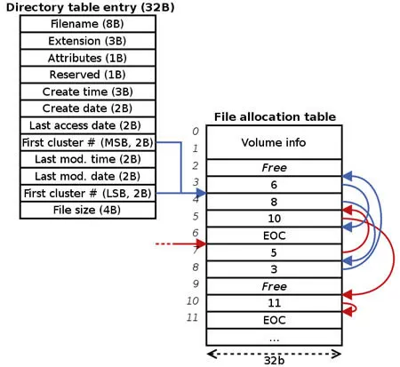

# FAT32 File System: A Detailed Explanation

**FAT** is an acronym for **"File Allocation Table"**.

---
## Overview and History 📜

* It is a file system developed for personal computers and was the default for **MS-DOS** and the **Windows 9x** family of operating systems.
* It was originally developed in **1977**.
* Initially used for **floppy disks**, it was later adapted for use on hard disks and other devices.
* The continuous increase in disk drive capacity led to several improved versions: **FAT12, FAT16, FAT32, and exFAT**.
* FAT was eventually replaced by **NTFS** as the default file system in Microsoft operating systems, starting with **Windows XP**.
* Despite its age, **FAT** is still commonly used on smaller-capacity storage like **USB flash drives**, **SD cards**, **MMC**, and **eMMC**. The primary reason is its <u>**excellent compatibility across different operating systems and embedded systems, and its ease of implementation.**</u>
* **FAT32** is the most recent major version of the FAT file system family.
---
## Design of The FAT File System

The FAT file system was a foundational component of **MS-DOS** and the **Windows 9x** operating systems. It remains relevant today in mobile devices and embedded systems, making it a well-suited file system for data exchange between computers and devices of almost any type and age from **1981** to the present.

---
## FAT32 Architecture

- **FAT File system regions, it includes four main regions** :

| **Region** | Reserved Sectors | FAT Region | Root Directory Region | Data Region |
|---|---|---|---|---|
| **Size in sectors**| number of reserved sectors| (number of FATs) *(sectors per FAT) | (number of root entries* 32) / (bytes per sector) | (number of clusters) * (sectors per cluster) |
| **Contents** | Boot Sector \| fs information sector(FAT32 only) \| More reserved Sectors *(optional)* | File Allocation Table #1 \| File Allocation Table #2 ... *(optional)*| Root Directory (FAT12 and FAT16 only) | Data Region (for files and directories) ... (to end of partition or disk) |
| **Notes** | The first reserved sector (logical sector 0) is the Boot Sector (also called Volume Boot Record or simply VBR). It includes an area called the BIOS Parameter Block (BPB) which contains some basic file system information, in particular its type and pointers to the location of the other sections, and usually contains the operating system's boot loader code.Important information from the Boot Sector is accessible through an operating system structure called the Drive Parameter Block (DPB) in DOS and OS/2.The total count of reserved sectors is indicated by a field inside the Boot Sector, and is usually 32 on FAT32 file systems.[4]For FAT32 file systems, the reserved sectors include a File System Information Sector at logical sector 1 and a Backup Boot Sector at logical sector 6. While many other vendors have continued to utilize a single-sector setup (logical sector 0 only) for the bootstrap loader, Microsoft's boot sector code has grown to span over logical sectors 0 and 2 since the introduction of FAT32, with logical sector 0 depending on sub-routines in logical sector 2. The Backup Boot Sector area consists of three logical sectors 6, 7, and 8 as well. In some cases, Microsoft also uses sector 12 of the reserved sectors area for an extended boot loader. | This typically contains two copies of the File Allocation Table for the sake of redundancy checking, although rarely used, even by disk repair utilities. These are maps of the Data Region, indicating which clusters are used by files and directories. In FAT12 and FAT16 they immediately follow the reserved sectors. Typically the extra copies are kept in tight synchronization on writes, and on reads they are only used when errors occur in the first FAT. The first two clusters (cluster 0 and 1) in the map contain special values.  | This is a Directory Table that stores information about the files and directories located in the root directory. It is only used with FAT12 and FAT16, and imposes on the root directory a fixed maximum size which is pre-allocated at creation of this volume. FAT32 stores the root directory in the Data Region, along with files and other directories, allowing it to grow without such a constraint. Thus, for FAT32, the Data Region starts here. | This is where the actual file and directory data is stored and takes up most of the partition. FAT32 typically commences the Root Directory Table in cluster number 2: the first cluster of the Data Region. |

Important Notes

* The traditional size of a sector is 512 bytes. However, most modern hard drives use a 4096-byte (4KB) physical sector size, a technology known as Advanced Format (AF).
* The fixed-size **Root Directory** only exists in **FAT12 & FAT16**. A key improvement in FAT32 is that the root directory is stored in the Data Region like any other folder, allowing it to grow as needed.
* The maximum size for a **single file** in FAT32 is **4 GB**. This is because the Directory Entry uses a 32-bit field to store the file size, and a 32-bit number cannot represent a value larger than 4 GB.

---
## How FAT32 Works: The Directory Entry & File Allocation Table

This image perfectly summarizes how the FAT file system works. It illustrates the relationship between the two main components: the **Directory Entry** and the **File Allocation Table (FAT)**.

---
### 1. On the Left: The Directory Entry

This is essentially a "metadata card" or an ID card for every file and folder. It has a fixed size of **32 bytes** and is composed of several fields, the most important of which are:

- **Filename/Extension (11 Bytes):** The name and extension of the file (8 characters for the name and 3 for the extension).
- **Attributes (1 Byte):** File properties (e.g., read-only, hidden, system).
- **Date & Time Fields:** Multiple fields to store the file's creation and modification timestamps.
- **File Size (4 Bytes):** The **total size of the file in bytes**. This is the critical field that causes the 4 GB limit because it's only 32-bits.
- **First Cluster # (4 Bytes):** The **most important field on the card**, this is the address or number of the **first cluster (the first piece)** of the file on the hard disk.

In the example in the image, this Directory Entry tells us that the file begins at **cluster #`4`**.

---

### 2. On the Right: The File Allocation Table (FAT)

This is the "brain" of the file system. It's a master map or a giant index for the entire partition. Every entry in this table represents a cluster on the hard disk, and the entry's index is the cluster number.

The value written inside each entry indicates one of three things:

- **`Free`:** The cluster is empty and available for use.
- **`EOC (End of Chain)`:** A special marker meaning this is the last cluster in a file.
- **Another Cluster Number:** This means, "After you read this cluster, go to cluster number X to continue reading the file."

---

### How The Components Work Together 🔗

The image shows how a specific file is read by forming a "chain":

1. The operating system starts with the **Directory Entry** to learn two things: that the file begins at cluster **`4`** and what its total size is.
2. It goes to the **FAT** table and looks at entry #**`4`**.
3. It finds the value **`6`** inside. This means "The next part of the file is in cluster #6."
4. It reads the data from cluster 4, then goes to entry #**`6`** in the table.
5. It finds the value **`8`** inside. This means "The next part is in cluster #8."
6. It continues this process, following the blue-arrowed chain:
    `4 → 6 → 8 → 3 → 5 → 10 → 11`
7. When it reaches entry #**`11`**, it finds the **`EOC`** marker. At this point, it knows the file is complete and stops the reading process.

**In short:** The Directory Entry gives you the **starting point of the chain**, and the FAT allows you to follow that chain link by link until you reach the end.

